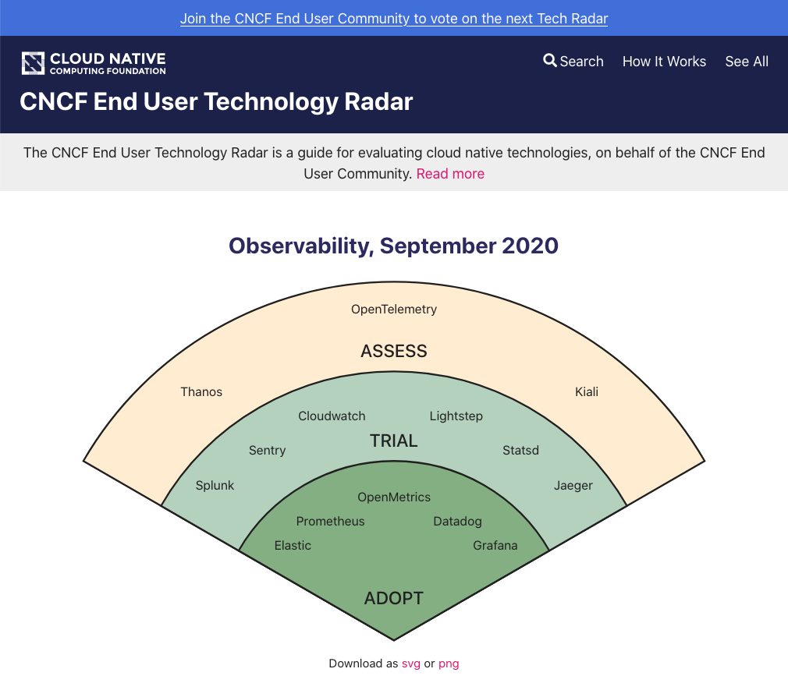
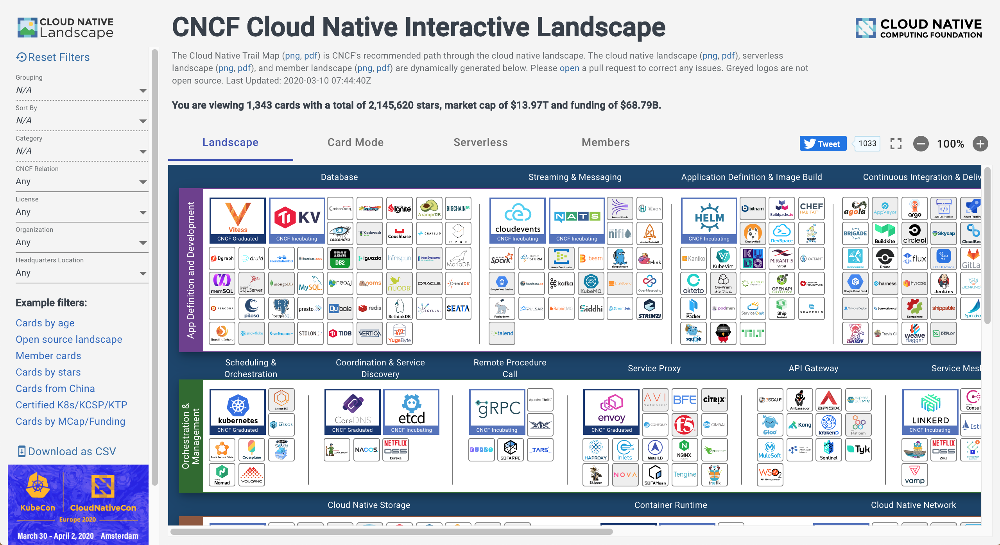

# Hello I'm Jordi!

I'm a Software Engineer with more than 12 years experience. I work mainly with Ruby on Rails but I also have extensive experience with NodeJS and ReactJS. I've worked in London, San Francisco and New York, for companies of different sizes, from as little as 3 people to 1000s of people. Now I work remotely from Barcelona, preferably looking for contract work, but I'm open to discuss permanent positions if they sound interesting.

I can help you get your project through the finish line. I like simplicity and solving complex problems. I can also provide feedback around roadmap, product management and project management. 

Some examples of my work are:

## CNCF Radar ([radar.cncf.io](https://radar.cncf.io))



A technology radar is an opinionated guide to a set of emerging technologies. The CNCF End User Technology Radar is intended for a technical audience who want to understand what solutions end users use in cloud native, and which they recommend.

The Radar is an opinionated CMS built with next.js. It allows administrators to add YAML files containing the Radar content and it automatically generates the radar page including the graphical radar and different charts and tables.

Technologies: NodeJS, next.js, React, Netlify.

## CNCF Landscape ([landscape.cncf.io](https://landscape.cncf.io))



The Cloud Native Interactive Landscape filters and sorts hundreds of projects and products related to the CNCF, and shows details including GitHub stars, funding or market cap, first and last commits, contributor counts, headquarters location, and recent tweets.

I joined this project after it already launched. I was responsible for adding new features and bug fixing. Some of my work included making the site more responsive or fixing a11y.

Technologies: NodeJS, React, Netlify.

## Haulhub ([haulhub.com](haulhub.com))


HaulHub develops a platform for heavy construction companies that powers transportation and digital ticketing for producers and contractors.

Was part of a 10+ people engineering team. I worked on building end-to-end features on Ruby on Rails and also adding JSON API endpoints used by their different mobile Apps.

Technologies: Ruby on Rails, Postgres, React, Heroku, Sidekiq, Docusign.

## Roomsie ([roomsie.com](roomsie.com))


Roomsie is an AirBnB-like marketplace for interns.

Was part of a two people engineering team. The project failed to launch for over two years and our team managed to launch in a few months. I was responsible for building an API in Ruby on Rails while the other engineer focused on building a React front-end. Was responsible for making all decisions related to back-end, including integrating with payments provider, designing complex payment system (multiple charges, multiple payouts, escrow, refunding deposits...) or designing the different booking states (requested, accepted, started, finished, refunded, ...).

Technologies: Ruby on Rails, Postgres, Heroku, Assembly Payments, Twilio, Google Maps, Sidekiq.

## HNHiring ([hnhiring.com](https://hnhiring.com))


HNHiring is an index of jobs from Hacker News' _Who is Hiring?_ posts.

This is a side project that I created a few years ago and I still maintain.

Technologies: Ruby on Rails, Postgres, Heroku.

## Open Source

### Operating Hours

[Operating Hours](https://github.com/spreemo/operating_hours) is a Ruby Gem that makes time calculations based on business hours. It's inspired by [business_time](https://github.com/bokmann/business_time) but with improved performance. See tables below for a comparison of the performance of calculating the business time between two random dates:

```
Business time:
Distance        | Execution time  | Result
--------------- | --------------- | ---------------
1 year apart    | 24.077092       | 7257600.0
6 months apart  | 12.693819       | 3744000.0
3 months apart  | 6.426698        | 1814400.0
1 month apart   | 2.466015        | 576000.0
2 weeks apart   | 1.459892        | 259200.0
1 week apart    | 1.00986         | 115200.0
2 days apart    | 0.776951        | 28800.0
1 day apart     | 0.839757        | 28800.0
Same day        | 0.595277        | 14400.0

Operating Hours:
Distance        | Execution time  | Result
--------------- | --------------- | ---------------
1 year apart    | 0.00949         | 7257600
6 months apart  | 0.01707         | 3744000
3 months apart  | 0.012577        | 1814400
1 month apart   | 0.029238        | 576000
2 weeks apart   | 0.018997        | 259200
1 week apart    | 0.019849        | 115200
2 days apart    | 0.010557        | 28800
1 day apart     | 0.016287        | 28800
Same day        | 0.020898        | 14400
```

You can read a longer explanation in this [blog post](https://medium.com/hackernoon/how-to-calculate-business-time-between-two-times-efficiently-681ac9984927)
